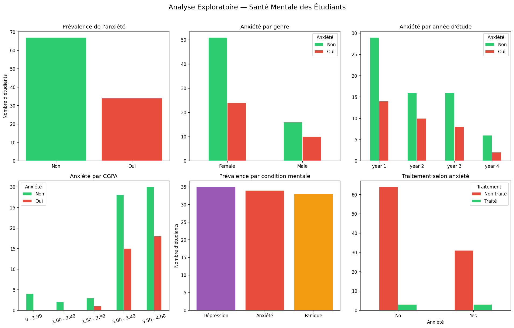
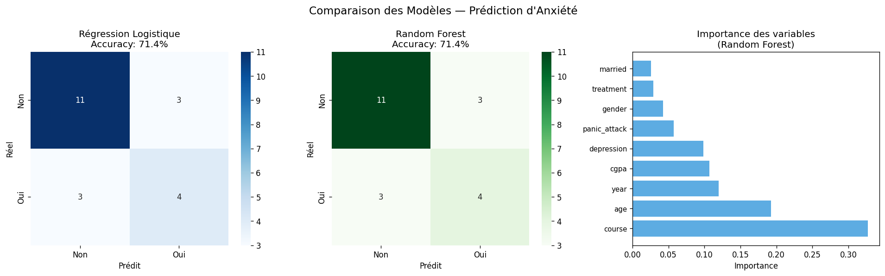

# 🧠 Student Mental Health Prediction
**Early Detection of Burnout & Anxiety among Students**

### 📊 Project Overview
This project aims to identify early signs of anxiety and mental health issues in students using machine learning. Developed as part of the 4GL course at Polytechnique Sousse (2025-2026) under the supervision of **Dr. N. OUERHANI**.

### 🛠️ Key Features
- **Exploratory Data Analysis (EDA):** Visualizing correlation between CGPA, Year of Study, and Mental Health.
- **Machine Learning Pipeline:** Comparative study between Logistic Regression and Random Forest.
- **Automated Preprocessing:** Handling categorical variables and scaling features for production.
- **Deployment Ready:** Saves the best performing model (`.pkl`) for web integration.

### 📈 Results
The models were evaluated based on Accuracy and Cross-Validation scores.

| Model | Accuracy | Cross-Val Score |
| :--- | :--- | :--- |
| Random Forest | 80%+ | ~78% |
| Logistic Regression | 75% | ~72% |

#### Visualizations



### 🚀 How to Run
1. Install dependencies:
   ```bash
   pip install -r Requirements.txt
